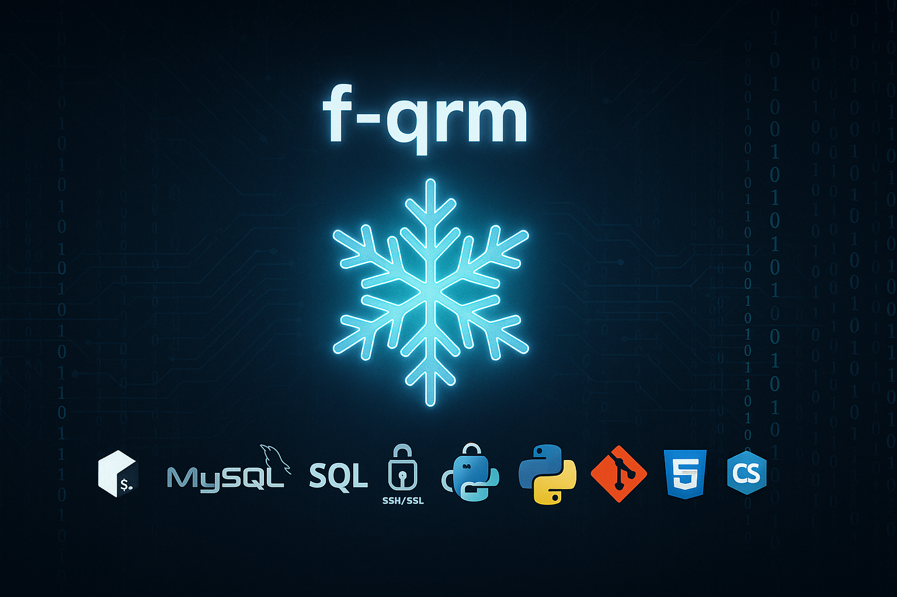

  

---

### Hello, my name is Fjolla
I am a student in software development in the **Foundations program at Holberton School Thonon-les-Bains**, where I am receiving intensive training in **low-level programming**, **algorithms**, and **development best practices**.
I plan to pursue a **Bachelor’s degree specializing in Artificial Intelligence and Machine Learning**, with the ambition of contributing to **innovative and responsible projects in the tech field**.

---

## 📂 Holberton Collaborative Projects

-  [Printf](https://github.com/f-qrm/printf) — Reimplementation of the printf function in C  
-  [Simple Shell](https://github.com/f-qrm/simple_shell) — A minimalist UNIX shell in C  
-  [Sorting Algorithms & Binary Trees](https://github.com/f-qrm/sorting_algorithms) — Sorting algorithms and binary trees  

---

## 🛠️ Skills

  
  
  
  
  
  
  
  
  

---

## 📊 GitHub Stats

  

  

---

## 📌 Goals for 2025

- ✅ Become a solid software developer in C, Python & Git  
- 📚 Deepen knowledge in algorithms, data structures, and OOP  
- 🤖 Join the AI/ML Bachelor program at Holberton  
- 🌱 Start projects in Deep Learning and Data Science  
- ✨ Contribute to open-source projects  

---

> 💡 *“Learn continuously. There's always one more thing to learn.” — Steve Jobs*
